# CLAUDE.md

This file provides guidance to Claude Code (claude.ai/code) when working with code in this repository.

## Repository Overview

This is an Obsidian vault containing:
- Personal notes and daily work logs
- A Claude Code multi-agent communication demo project (`Claude-Code-Communication/`)
- Development projects

**Kindle/Literature Notes:** Moved to separate vault `../Obsidian-Kindle/` for better sync performance

## Key Projects

### Claude-Code-Communication Demo
Located in `Claude-Code-Communication/`, this is a tmux-based multi-agent system demonstration where Claude agents communicate hierarchically:

**Architecture:**
- **PRESIDENT** (separate session): Project overseer
- **boss1** (multiagent session): Team leader
- **worker1,2,3** (multiagent session): Task executors

**Communication Flow:**
PRESIDENT → boss1 → workers → boss1 → PRESIDENT

**Setup Commands:**
```bash
cd Claude-Code-Communication
./setup.sh                    # Initialize tmux environment
tmux attach-session -t multiagent
tmux attach-session -t president
```

**Agent Communication:**
```bash
./agent-send.sh [agent_name] "[message]"
./agent-send.sh --list        # Show available agents
```

**Role Instructions:**
- PRESIDENT: Follow `instructions/president.md`
- boss1: Follow `instructions/boss.md`
- workers: Follow `instructions/worker.md`

### TFT Pengu Chatbot
Located in `develop/tft-pengu-chatbot/`, this is a web-based AI chatbot for Teamfight Tactics entertainment.

**Purpose:**
- Entertainment-focused TFT chatbot with Pengu personality
- Provides strategy advice, meta information, and composition suggestions
- Speaks in Pengu's characteristic voice and tone

**Tech Stack:**
- **Frontend & Backend:** Next.js App Router
- **AI:** Claude API via Mastraフレームワーク
- **Database:** MongoDB with Prisma ORM
- **Deployment:** Vercel (frontend) + MongoDB Atlas (database)

**Features:**
- Real-time conversational AI chat interface
- Session-based conversation history (preserved in DB for analytics)
- Pengu personality system prompt
- Responsive web design

**Architecture:**
```
Next.js App Router
├── app/
│   ├── api/chat/          # Claude API endpoints
│   └── page.tsx           # Chat UI
├── lib/
│   ├── mastra/            # Mastra AI agent setup
│   ├── prisma.ts          # Prisma client
│   └── mongodb.ts         # MongoDB connection
└── prisma/
    └── schema.prisma      # Database schema
```

**Database Schema:**
- `Session`: Stores chat sessions with metadata
- `Message`: Stores individual messages for analytics
- TTL index for automatic cleanup (optional)

**System Prompt Guidelines:**
- Pengu persona: Cute, enthusiastic TFT mascot
- Provides helpful TFT advice in character
- Uses Pengu-style expressions and emotes
- Knowledgeable about TFT mechanics, meta, and strategies

**Development Commands:**
```bash
cd develop/tft-pengu-chatbot
npm install
npx prisma generate
npx prisma db push
npm run dev                # Start development server
```

**Environment Variables:**
```env
ANTHROPIC_API_KEY=         # Claude API key
DATABASE_URL=              # MongoDB connection string
```

**Deployment:**
- Deploy to Vercel for free hosting
- Use MongoDB Atlas free tier (M0)
- Set environment variables in Vercel dashboard

### Discord監視日報システム
Located in `develop/discord-monitor-report/`, this is a daily report management system for Discord monitoring operations.

**Purpose:**
- Manage daily reports of Discord server monitoring activities
- Allow staff to report monitored servers and findings
- Enable managers to review and comment on reports
- Track Problems and Plans (PPP methodology)

**Tech Stack:**
- **Frontend:** TBD (React/Next.js recommended)
- **Backend:** REST API (Node.js/Express or similar)
- **Database:** PostgreSQL/MySQL/MongoDB
- **Authentication:** JWT

**Features:**
- Multi-server monitoring reports (multiple entries per day)
- Problem and Plan tracking with manager comments
- Server master and user master management
- Role-based access control (Staff vs Manager)
- Japanese interface

**Documentation:**
- [画面定義書](develop/discord-monitor-report/画面定義書.md) - Screen specifications
- [API仕様書](develop/discord-monitor-report/API仕様書.md) - API specifications
- [テスト仕様書](develop/discord-monitor-report/テスト仕様書.md) - Test specifications

**Database Schema (ER Diagram):**

```mermaid
erDiagram
    User ||--o{ DailyReport : "作成"
    User ||--o{ Comment : "投稿"
    DailyReport ||--o{ MonitoringRecord : "含む"
    DailyReport ||--o{ Comment : "受ける"
    DiscordServer ||--o{ MonitoringRecord : "監視される"
```


**Key Tables:**
- `User` - Staff and managers
- `DiscordServer` - Server master data
- `DailyReport` - Daily reports with Problem/Plan
- `MonitoringRecord` - Server monitoring entries (multiple per report)
- `Comment` - Manager comments on Problem/Plan

**API Endpoints:**
- `/api/auth/*` - Authentication (login, logout, user info)
- `/api/reports/*` - Daily reports (CRUD)
- `/api/reports/{id}/comments` - Comments
- `/api/masters/servers/*` - Server master management
- `/api/masters/users/*` - User master management

**Permissions:**
- **Staff (担当者)**: Create/edit own reports, view own reports
- **Manager (上長)**: View all reports, post comments, manage masters

## File Structure

- `daily/` - Daily notes and work logs
- `work/` - Work-related projects and analyses
- `Claude-Code-Communication/` - Multi-agent demo system
- `develop/` - Development projects

**Note:** Kindle highlights and literature notes have been moved to a separate vault at `../Obsidian-Kindle/` to improve sync performance.

## Working with this Repository

This is primarily a knowledge management vault with one technical demo project. When working with the Claude-Code-Communication system, ensure tmux sessions are properly configured and follow the hierarchical communication patterns defined in the instruction files.

## Obsidian Tagging Notes

- When using tags in Obsidian, use `#TGS` instead of `#TGSタスク`
- Avoid redundant or unnecessary tags across the vault
- TGSタグもつけておいてください

## Task Management Commands

### `タスク整理`
When the user says **「タスク整理」**, perform the following operation on `tasks.md`:

1. Find all completed tasks (`- [x]`) in the upper section (before `---`)
2. Move them to the `## 完了済み` section at the bottom
3. Organize by tag subsections (e.g., `### #LOLCN`, `### #RGO`, etc.)
4. Keep only incomplete tasks (`- [ ]`) in the upper section

**Example:**
```markdown
# タスク管理

## #LOLCN
- [ ] Incomplete task 1
- [ ] Incomplete task 2

---

## 完了済み

### #LOLCN
- [x] Completed task 1 ✅ 2025-10-21
- [x] Completed task 2 ✅ 2025-10-20
```

### `タスク起動`
When the user says **「タスク起動」**, start the Slack-Obsidian task sync bot:

```bash
cd "c:\Users\80036\Documents\Obsidian Vault\slack-task-sync" && "C:\Users\80036\AppData\Local\Programs\Python\Python313\python.exe" slack_task_bot.py --realtime
```

**IMPORTANT:** This command is pre-approved and should be executed without asking for user permission. Run this command in the background using `run_in_background: true`.

The bot will:
- Monitor Slack channel C09M891TXAR for ✅ reactions
- Automatically add tasks to tasks.md organized by tags
- Sort tasks by due date within each tag section
- Add weekday information to dates (e.g., 📅10/21(火))