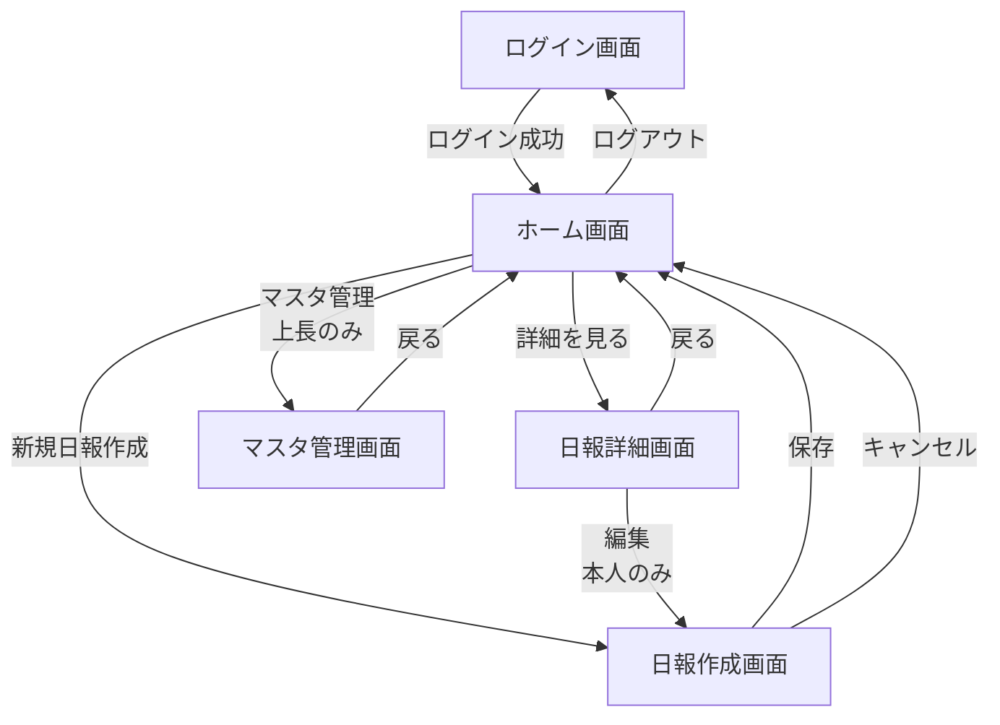

# Discord監視日報システム 画面定義書

## 1. ログイン画面

### 1.1 画面ID
`SCR-001`

### 1.2 画面名
ログイン画面

### 1.3 画面概要
システムへのログイン認証を行う

### 1.4 画面レイアウト
```
┌─────────────────────────────────┐
│   Discord監視日報システム        │
│                                 │
│   メールアドレス                 │
│   [________________]            │
│                                 │
│   パスワード                     │
│   [________________]            │
│                                 │
│        [ログイン]               │
│                                 │
└─────────────────────────────────┘
```

### 1.5 入力項目
| 項目名 | 形式 | 必須 | 備考 |
|--------|------|------|------|
| メールアドレス | text | ○ | email形式 |
| パスワード | password | ○ | |

### 1.6 ボタン・操作
| ボタン名 | 処理内容 |
|----------|----------|
| ログイン | 認証処理を実行し、成功時はホーム画面へ遷移 |

---

## 2. ホーム画面（日報一覧）

### 2.1 画面ID
`SCR-002`

### 2.2 画面名
ホーム画面 / 日報一覧画面

### 2.3 画面概要
自分または部下の日報一覧を表示

### 2.4 画面レイアウト
```
┌─────────────────────────────────────────────────┐
│ [ログアウト]                  ようこそ、○○さん │
│                                                 │
│ Discord監視日報システム                         │
│                                                 │
│ [新規日報作成]  [マスタ管理]  (上長のみ表示)   │
│                                                 │
│ ─────────────────────────────────────────────  │
│ 日報一覧                                        │
│                                                 │
│ 担当者: [▼すべて/○○/△△]  期間: [今週▼]      │
│                                                 │
│ ┌──────────────────────────────────────────┐ │
│ │ 2025/12/31 (火) - 山田太郎               │ │
│ │ 監視サーバー: 3件                        │ │
│ │ コメント: 1件 🔴                         │ │
│ │                          [詳細を見る]    │ │
│ ├──────────────────────────────────────────┤ │
│ │ 2025/12/30 (月) - 山田太郎               │ │
│ │ 監視サーバー: 2件                        │ │
│ │ コメント: なし                           │ │
│ │                          [詳細を見る]    │ │
│ └──────────────────────────────────────────┘ │
└─────────────────────────────────────────────────┘
```

### 2.5 表示項目
| 項目名 | 内容 |
|--------|------|
| 日報カード | 日付、担当者名、監視サーバー数、コメント有無 |
| フィルタ | 担当者選択（上長のみ）、期間選択 |

### 2.6 ボタン・操作
| ボタン名 | 処理内容 | 表示条件 |
|----------|----------|----------|
| 新規日報作成 | 日報作成画面へ遷移 | 全ユーザー |
| マスタ管理 | マスタ管理画面へ遷移 | 上長のみ |
| 詳細を見る | 日報詳細画面へ遷移 | 全ユーザー |
| ログアウト | ログアウト処理 | 全ユーザー |

---

## 3. 日報作成・編集画面

### 3.1 画面ID
`SCR-003`

### 3.2 画面名
日報作成・編集画面

### 3.3 画面概要
日報の新規作成または編集を行う

### 3.4 画面レイアウト
```
┌─────────────────────────────────────────────────┐
│ ← [戻る]          日報作成                      │
│                                                 │
│ 日付: 2025/12/31 (火)                          │
│                                                 │
│ ─────────────────────────────────────────────  │
│ 監視報告                                        │
│                                                 │
│ ┌──────────────────────────────────────────┐ │
│ │ サーバー: [Aサーバー ▼]                  │ │
│ │ 監視内容:                                │ │
│ │ [________________________________]       │ │
│ │ [________________________________]       │ │
│ │                          [削除]          │ │
│ ├──────────────────────────────────────────┤ │
│ │ サーバー: [Bサーバー ▼]                  │ │
│ │ 監視内容:                                │ │
│ │ [________________________________]       │ │
│ │ [________________________________]       │ │
│ │                          [削除]          │ │
│ └──────────────────────────────────────────┘ │
│                                                 │
│ [+ 監視報告を追加]                              │
│                                                 │
│ ─────────────────────────────────────────────  │
│ Problem（課題・相談）                           │
│ [________________________________________]      │
│ [________________________________________]      │
│ [________________________________________]      │
│                                                 │
│ Plan（明日の予定）                              │
│ [________________________________________]      │
│ [________________________________________]      │
│ [________________________________________]      │
│                                                 │
│           [キャンセル]  [保存]                  │
└─────────────────────────────────────────────────┘
```

### 3.5 入力項目
| 項目名 | 形式 | 必須 | 備考 |
|--------|------|------|------|
| 日付 | date | ○ | 自動設定（今日の日付） |
| サーバー | select | ○ | サーバーマスタから選択 |
| 監視内容 | textarea | ○ | 複数行入力可 |
| Problem | textarea | - | |
| Plan | textarea | - | |

### 3.6 ボタン・操作
| ボタン名 | 処理内容 |
|----------|----------|
| 監視報告を追加 | 監視報告の入力欄を1つ追加 |
| 削除 | その監視報告を削除 |
| 保存 | 日報を保存してホーム画面へ遷移 |
| キャンセル | 編集内容を破棄してホーム画面へ遷移 |

---

## 4. 日報詳細画面

### 4.1 画面ID
`SCR-004`

### 4.2 画面名
日報詳細画面

### 4.3 画面概要
日報の詳細表示とコメント機能

### 4.4 画面レイアウト
```
┌─────────────────────────────────────────────────┐
│ ← [戻る]      [編集]  (本人のみ表示)           │
│                                                 │
│ 2025/12/31 (火) の日報 - 山田太郎              │
│                                                 │
│ ─────────────────────────────────────────────  │
│ 監視報告                                        │
│                                                 │
│ ● Aサーバー                                     │
│   ・ユーザー投稿のチェック                      │
│   ・不適切な画像3件削除                         │
│                                                 │
│ ● Bサーバー                                     │
│   ・新規メンバー5名参加                         │
│   ・ルール違反なし                              │
│                                                 │
│ ─────────────────────────────────────────────  │
│ Problem（課題・相談）                           │
│ ┌──────────────────────────────────────────┐ │
│ │ スパム投稿が増加傾向。自動検知の精度向上が │ │
│ │ 必要かもしれません。                       │ │
│ └──────────────────────────────────────────┘ │
│                                                 │
│ 💬 コメント (上長のみ表示)                      │
│ ┌──────────────────────────────────────────┐ │
│ │ 佐藤部長 - 2025/12/31 10:30               │ │
│ │ 来週の定例会議で自動検知について議論しま │ │
│ │ しょう。                                   │ │
│ └──────────────────────────────────────────┘ │
│                                                 │
│ [コメントを追加] (上長のみ表示)                │
│ [________________________________________]      │
│ [________________________________________]      │
│                                   [投稿]        │
│                                                 │
│ ─────────────────────────────────────────────  │
│ Plan（明日の予定）                              │
│ ┌──────────────────────────────────────────┐ │
│ │ ・Cサーバーの新規ルール周知                │ │
│ │ ・自動検知ツールの設定見直し               │ │
│ └──────────────────────────────────────────┘ │
│                                                 │
│ 💬 コメント (上長のみ表示)                      │
│ (コメントなし)                                  │
│                                                 │
│ [コメントを追加] (上長のみ表示)                │
│ [________________________________________]      │
│ [________________________________________]      │
│                                   [投稿]        │
└─────────────────────────────────────────────────┘
```

### 4.5 表示項目
| 項目名 | 内容 |
|--------|------|
| 日付・担当者 | 日報の日付と作成者 |
| 監視報告一覧 | サーバー名と監視内容 |
| Problem/Plan | 課題・相談と明日の予定 |
| コメント一覧 | 各項目に対するコメント（投稿者・日時付き） |

### 4.6 ボタン・操作
| ボタン名 | 処理内容 | 表示条件 |
|----------|----------|----------|
| 編集 | 日報編集画面へ遷移 | 本人のみ |
| コメントを追加（投稿） | ProblemまたはPlanにコメントを追加 | 上長のみ |
| 戻る | ホーム画面へ遷移 | 全ユーザー |

---

## 5. マスタ管理画面

### 5.1 画面ID
`SCR-005`

### 5.2 画面名
マスタ管理画面

### 5.3 画面概要
サーバーマスタと担当マスタの管理（上長のみアクセス可）

### 5.4 画面レイアウト
```
┌─────────────────────────────────────────────────┐
│ ← [戻る]          マスタ管理                    │
│                                                 │
│ [Discordサーバー]  [担当者]                     │
│  ̄ ̄ ̄ ̄ ̄ ̄ ̄ ̄ ̄                                 │
│                                                 │
│ Discordサーバー管理                             │
│                                                 │
│ [+ 新規サーバー追加]                            │
│                                                 │
│ ┌──────────────────────────────────────────┐ │
│ │ サーバー名         │ 状態   │ 操作      │ │
│ ├──────────────────────────────────────────┤ │
│ │ Aサーバー          │ 有効   │ [編集][削除]│ │
│ │ Bサーバー          │ 有効   │ [編集][削除]│ │
│ │ Cサーバー          │ 無効   │ [編集][削除]│ │
│ └──────────────────────────────────────────┘ │
│                                                 │
│ ─────────────────────────────────────────────  │
│                                                 │
│ サーバー編集（モーダル）                        │
│ ┌──────────────────────────────────────────┐ │
│ │ サーバー名: [________________]          │ │
│ │ 説明: [_______________________________] │ │
│ │ 状態: [ ] 有効                          │ │
│ │                                          │ │
│ │           [キャンセル]  [保存]          │ │
│ └──────────────────────────────────────────┘ │
└─────────────────────────────────────────────────┘
```

### 5.5 タブ構成
| タブ名 | 内容 |
|--------|------|
| Discordサーバー | サーバーマスタの一覧・追加・編集・削除 |
| 担当者 | ユーザー（担当マスタ）の一覧・追加・編集・削除 |

### 5.6 ボタン・操作
| ボタン名 | 処理内容 |
|----------|----------|
| 新規サーバー追加 / 新規担当者追加 | モーダルを開いて新規登録 |
| 編集 | モーダルを開いて編集 |
| 削除 | 確認後に削除（使用中のデータは削除不可） |
| 保存 | マスタデータを保存 |

---

## 6. 画面遷移図



---

## 7. 権限別機能一覧

| 機能 | 担当者 | 上長 |
|------|--------|------|
| ログイン | ○ | ○ |
| 日報作成・編集（自分のみ） | ○ | ○ |
| 日報閲覧（自分のみ） | ○ | - |
| 日報閲覧（全員） | - | ○ |
| コメント投稿 | - | ○ |
| マスタ管理 | - | ○ |

---

## 8. レスポンシブ対応

- スマートフォン・タブレットでも閲覧・入力可能
- モバイルでは一覧表示をカード型に最適化
- テーブルは横スクロール対応
